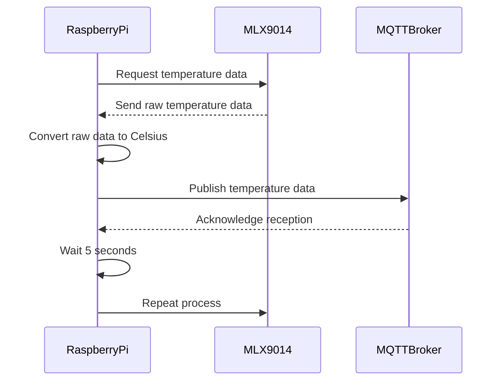

# Temperature-MLX9014

# Temperature Monitoring with MLX9014 Sensor to MQTT Broker

## Description
This program reads temperature data from the MLX9014 sensor using I2C communication on a Raspberry Pi. The temperature data is converted into Celsius and published to an MQTT broker asynchronously using aiomqtt. The process runs in a loop, sending data every 5 seconds.

## Libraries Used
- `smbus2`: For I2C communication with the MLX9014 sensor.
- `time`: For simple delays.
- `aiomqtt`: For asynchronous MQTT communication.
- `json`: For formatting data sent to MQTT.
- `asyncio`: For running asynchronous code.

## Subprograms
- **`read_temperature()`**: Reads temperature from the MLX9014 sensor and converts it to Celsius.
- **`main()`**: The main loop that connects to MQTT and sends temperature data every 5 seconds.

## Sequence Diagram


## How to Run
1. Ensure you have all required dependencies installed.
2. Connect the MLX9014 sensor to the Raspberry Pi via I2C.
3. Run the script using:
   ```bash
   python3 data_sensor.py
   

